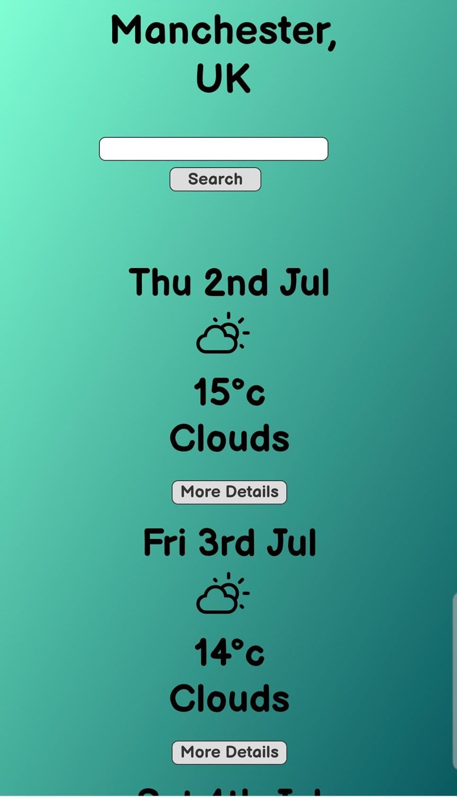
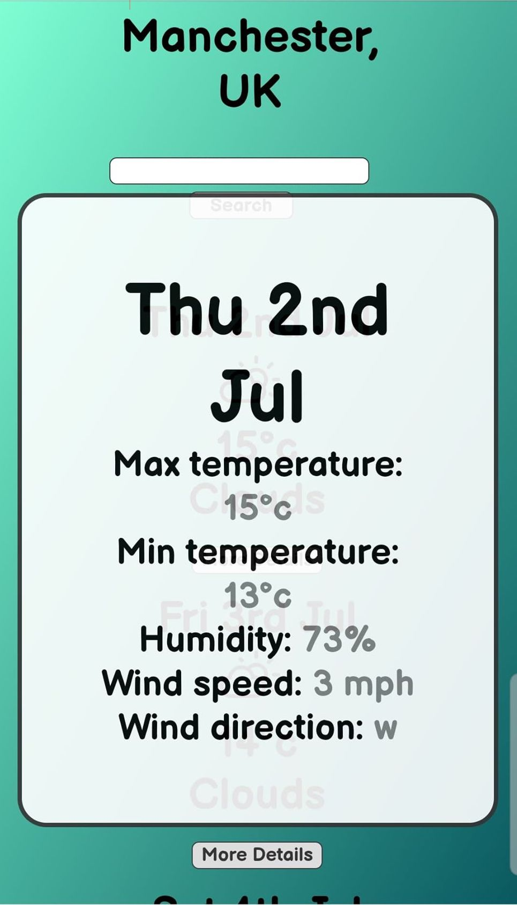
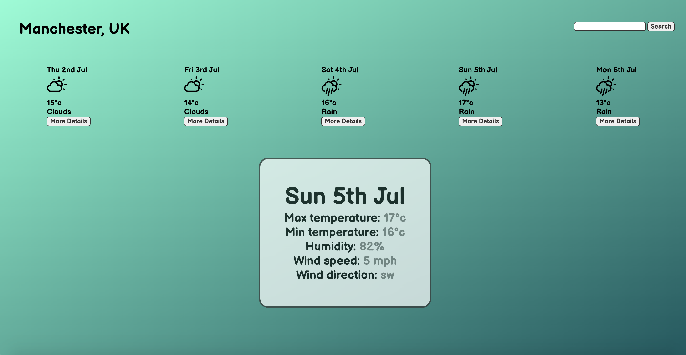
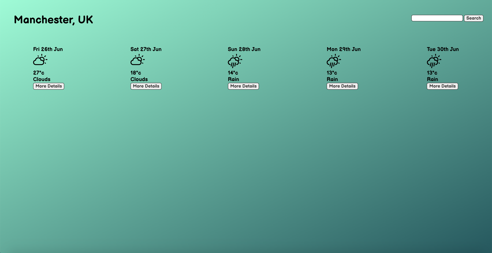

## Weather App

This was bootstrapped with [Create React App](https://github.com/facebook/create-react-app), and tested with Jest and the React Testing Library. 

## Phone screenshots

## Desktop screenshots

## Packages used 

These included: PropTypes, axios, react-icons-weather, moment and react-modal.

